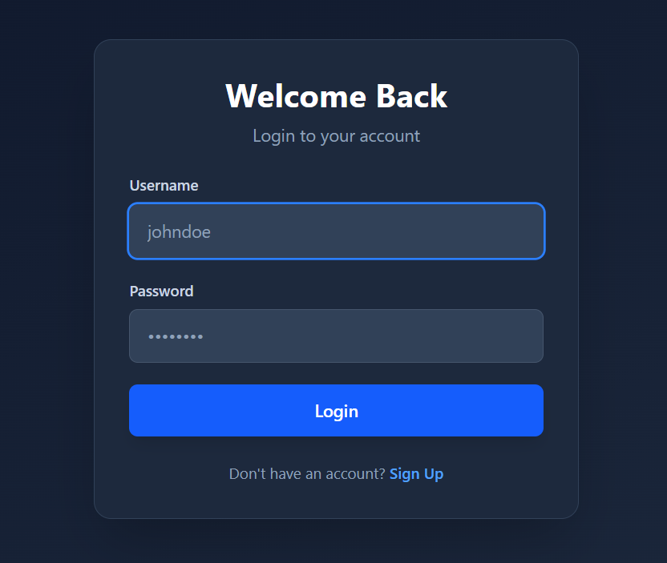
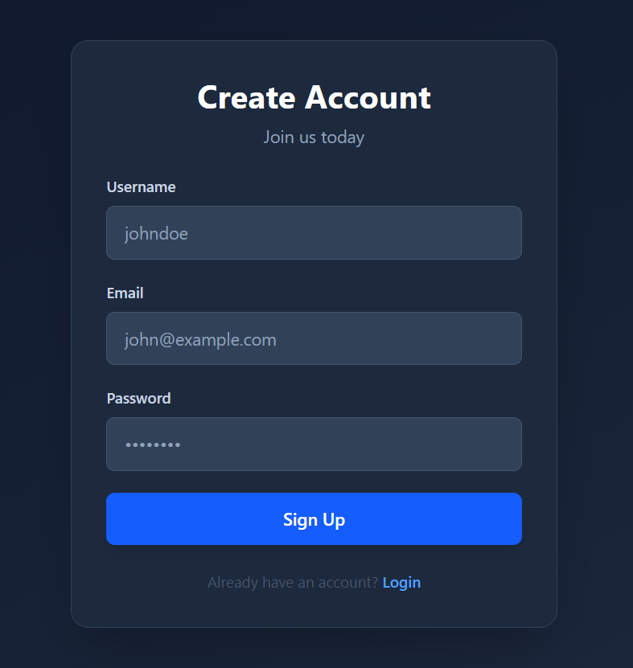
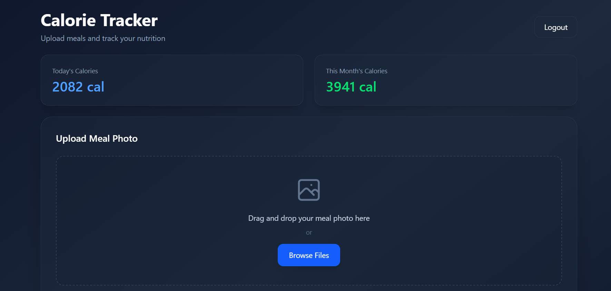
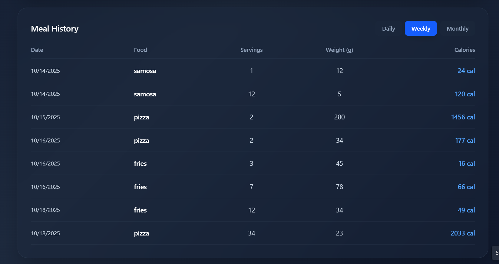

# 🍽️ Food Calorie Estimation Web App

An intelligent web application that automatically detects food items from images 🍕🥗 and estimates their total calorie content using **YOLOv8**, **Django REST API**, and **React**.  
Users can track and visualize their **daily**, **weekly**, and **monthly** calorie consumption through an **interactive dashboard**.

---

## 🚀 Project Overview

This app combines **AI-powered image recognition** with **personalized calorie tracking**.  
By uploading a meal photo, the system automatically detects the food items and calculates calories based on serving size and weight input by the user.  
All data is securely stored in the backend (**PostgreSQL**) and visualized beautifully in the React dashboard.

---

## 🧠 Key Features

- 📸 **Automatic Food Detection** using YOLOv8 model  
- 🍎 **Calorie Estimation** based on database values (calories per 100g)  
- 🧮 **User Input for Servings & Weight** for precise calorie computation  
- 📊 **Dynamic Dashboard** showing:
  - Daily, Weekly, and Monthly calorie consumption  
  - Total calorie summary cards (24-hour & monthly view)  
  - Food history table with calories and servings  
- 👤 **Secure Authentication** (Login/Signup with BMI-based calorie limit)  
- 💾 **Data Persistence** using **PostgreSQL**  
- 🌐 **RESTful APIs** connecting backend & frontend seamlessly  

---

## ⚙️ Tech Stack

| Component | Technology |
|------------|-------------|
| **Frontend** | React, TailwindCSS |
| **Backend** | Django REST Framework |
| **AI Model** | YOLOv8 (Ultralytics) |
| **Database** | PostgreSQL |
| **Visualization** | Chart.js / Recharts |
| **Auth** | JWT Authentication |
| **Languages** | Python, JavaScript |

---

## 🖥️ Dashboard Preview

| Feature | Description |
|----------|--------------|
| 📷 **Upload Section** | Upload food images and trigger YOLO detection |
| 🍴 **Detected Items** | Enter servings & weight for each detected item |
| 📊 **Calorie Table** | View all saved calorie records |
| 🔢 **Total Cards** | Show dynamic totals (Daily / Monthly) |
| 📅 **Tabs** | Switch between Daily, Weekly, and Monthly data views |

---

## 🖼️ Screenshots

### 🔹 Login Page

### 🔹 Signup Page

### 🔹 Dashboard Page

### 🔹 Food Detection Example

### 🔹 Calorie History View

---

## 🧰 Future Improvements

- 🍽️ **Portion size estimation** using image segmentation  
- 🧬 **Integration with health APIs** for personalized recommendations  
- ☁️ **Cloud model deployment** (AWS, Render, or Hugging Face Spaces)

---

## 👨‍💻 Author

**Abdur Rahim Tariq**  

📧 **Email:** [abdurrahimtariq.ds@gmail.com](mailto:abdurrahimtariq.ds@gmail.com)  
💻 **GitHub:** [Abdur-Rahim-Tariq](https://github.com/Abdur-Rahim-Tariq)
